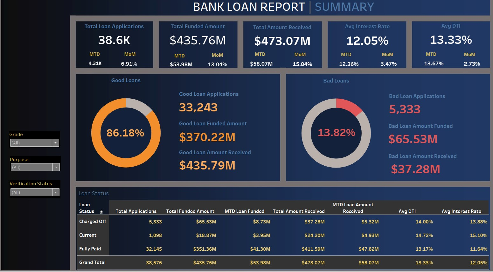
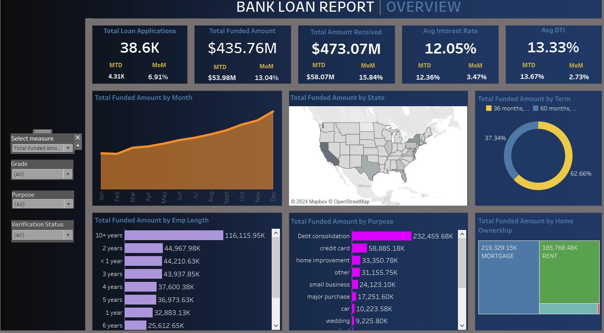

### Bank Loan Analysis

Tableau Dashboards:

Dashboard-1 Highlights:

* Calculated KPIs such as Month on Month profits, Total amount funded and received, avg interest rate
* Classified loan which made profit as Good Loan vs the loans incurred loss as Bad Loans (Good vs Bad loan metrics)
*  Created filters based on Grade, Purpose and Verification Status
  

Dashboard-2 Highlights:

* Created Dynamic measures:
  1. Total Loan Applications
  2. Total Funded Amount
  3. Total Amount Received

* Developed charts such as Line, Bar, Hierachy, Map to plot the dynamic measures by Month, State, Term, Employement Length, Purpose and Ownership

